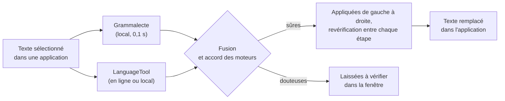

<div align="center">


# Correcteur

Correcteur d'orthographe et de grammaire pour Windows et Linux.<br>
On sélectionne un texte dans une application (navigateur, Word, Discord…), on appuie sur
<kbd>Ctrl</kbd> + <kbd>Alt</kbd> + <kbd>X</kbd> et il est remplacé par sa version corrigée.
<kbd>Ctrl</kbd> + <kbd>Alt</kbd> + <kbd>C</kbd> ouvre plutôt une fenêtre pour voir chaque faute avant de corriger.

[](https://github.com/mateo-brl/correcteur_orthographe/actions/workflows/tests.yml?query=branch%3Amaster)


[Installer](#installation) · [Utiliser](#utilisation) · [Limites](#limites-connues) · [Confidentialité](#moteurs-et-confidentialité) · [Comment ça marche](#comment-ça-marche) · [Tests](#tests-et-qualité)

</div>

<br>

## Aperçu

Trois phrases passées à la correction express, telles que le correcteur les rend :

```diff
- Je suis aller a la réunion hier, les résultats que j'ai obtenu sont bon.
+ Je suis allé à la réunion hier, les résultats que j'ai obtenus sont bons.

- Il faut que tu viens voir ça, les enfant était ravis !
+ Il faut que tu viennes voir ça, les enfants étaient ravis !

- Les filles sont parti tôt car elles étaient fatigué. Nous avons manger des pomme et on a bien rigoler.
+ Les filles sont parties tôt, car elles étaient fatiguées. Nous avons mangé des pommes et on a bien rigolé.
```

La fenêtre de correction, ouverte par <kbd>Ctrl</kbd> + <kbd>Alt</kbd> + <kbd>C</kbd> :

<table>
  <tr>
    <td></td>
    <td></td>
  </tr>
  <tr>
    <td align="center"><sub>Thème clair</sub></td>
    <td align="center"><sub>Thème sombre (suit le système)</sub></td>
  </tr>
</table>

## Pourquoi Correcteur

Deux moteurs tournent en même temps, [Grammalecte](https://grammalecte.net) sur le PC et
[LanguageTool](https://languagetool.org), et ils ne repèrent pas les mêmes fautes. Quand ils proposent la même
correction, elle est appliquée d'office ; sinon elle reste à vérifier. C'est pour ça que la correction express ne
change pas « fesait » en « fessait » : aucun des deux n'est sûr de lui sur ce mot.

Il n'y a pas d'IA, seulement des règles de grammaire. Grammalecte fonctionne sans Internet, et LanguageTool peut
tourner sur le PC si on ne veut rien envoyer en ligne. Sous Linux, l'application occupe environ 130 Mo de RAM et
n'utilise pas le processeur au repos.

La typographie est réglée pour l'écrit courant : pas de remarque sur les apostrophes courbes ou les espaces
insécables dans un message, et « stp » ou « rdv » passent. Un mode strict existe pour les documents soignés.

## Installation

### Windows

1. Téléchargez **`Correcteur-x.y.z-installation-windows.exe`** dans les
   [versions publiées](https://github.com/mateo-brl/correcteur_orthographe/releases).
2. Lancez-le. Il n'a pas besoin des droits administrateur.

> [!NOTE]
> Le programme n'est pas signé, donc Windows peut afficher « Windows a protégé votre ordinateur ».
> Cliquez sur *Informations complémentaires* puis *Exécuter quand même*.

Il existe aussi une version portable, **`Correcteur-x.y.z-windows-portable.zip`** : décompressez-la et lancez
`Correcteur.exe`.

### Linux

Téléchargez **`Correcteur-x.y.z-linux-x86_64.tar.gz`** au même endroit, puis :

```bash
tar xzf Correcteur-x.y.z-linux-x86_64.tar.gz
./Correcteur/installer-linux.sh
```

Le script installe tout dans `~/.local`, sans `sudo`. Il ajoute le correcteur au menu des applications et au
démarrage de session, puis le lance.

| Session | Paquets utiles (Debian / Ubuntu) |
|---|---|
| X11 | `libxcb-cursor0` (souvent déjà présent) |
| Wayland | `wl-clipboard`, plus `wtype` (Sway, KDE) ou `ydotool` (GNOME) pour le remplacement automatique |

<details>
<summary>Wayland : les raccourcis</summary>

<br>

Sous Wayland, une application n'a pas le droit d'écouter le clavier globalement. Les raccourcis se déclarent donc
dans les paramètres du bureau, avec ces commandes :

| Raccourci | Commande |
|---|---|
| <kbd>Ctrl</kbd> + <kbd>Alt</kbd> + <kbd>C</kbd> | `correcteur selection` |
| <kbd>Ctrl</kbd> + <kbd>Alt</kbd> + <kbd>X</kbd> | `correcteur express` |

Sous GNOME, le script d'installation les crée lui-même, et `correcteur raccourcis-gnome` fait la même chose.
La commande transmet l'ordre à l'application déjà lancée, qui réagit aussitôt.

</details>

<details>
<summary>Depuis les sources</summary>

<br>

Il faut Python 3.10 ou plus récent.

```bash
git clone https://github.com/mateo-brl/correcteur_orthographe
cd correcteur_orthographe
./scripts/installer-linux.sh                                              # Linux
powershell -ExecutionPolicy Bypass -File scripts\installer-windows.ps1   # Windows
```

</details>

## Utilisation

| Raccourci (modifiable) | Action |
|---|---|
| <kbd>Ctrl</kbd> + <kbd>Alt</kbd> + <kbd>C</kbd> | Ouvre la fenêtre de correction sur le texte sélectionné |
| <kbd>Ctrl</kbd> + <kbd>Alt</kbd> + <kbd>X</kbd> | Correction express : corrige directement le texte sélectionné |

Dans la fenêtre :

| Action | Effet |
|---|---|
| Clic sur un mot souligné | Suggestions, *Ignorer*, *Ajouter au dictionnaire* |
| Bouton *Corrections sûres* | Applique d'un coup tout ce qui est confirmé (un seul <kbd>Ctrl</kbd> + <kbd>Z</kbd> pour annuler) |
| <kbd>Ctrl</kbd> + <kbd>Entrée</kbd> | Remplace le texte dans l'application d'origine |
| <kbd>F8</kbd> / <kbd>Maj</kbd> + <kbd>F8</kbd> | Faute suivante / précédente |
| <kbd>Échap</kbd> | Ferme la fenêtre et rend le presse-papiers d'origine |

Couleurs : 🔴 orthographe · 🔵 grammaire · 🟠 ponctuation · 🟣 style. Le texte reste modifiable et la vérification
suit la frappe.

L'icône dans la zone de notification donne accès à « Vérifier le presse-papiers », à une fenêtre vide où taper
ou coller un texte, et aux paramètres.

<details>
<summary>En ligne de commande</summary>

<br>

```bash
correcteur verifier "Il faut que tu viens demain."     # liste les fautes
correcteur verifier --json --fichier lettre.txt         # sortie JSON, pour des scripts
echo "Je vais a la plage ." | correcteur corriger       # applique les corrections sûres
correcteur corriger --tout < brouillon.txt              # applique toutes les premières suggestions
correcteur diagnostic                                    # état de l'installation
```

`--hors-ligne` n'utilise que les moteurs locaux. Sous Windows, la commande s'appelle `correcteur-cli.exe`.

</details>

## Limites connues

- Dans un terminal, le remplacement automatique échoue. Le correcteur envoie <kbd>Ctrl</kbd> + <kbd>V</kbd>, alors
  que les terminaux collent avec <kbd>Ctrl</kbd> + <kbd>Maj</kbd> + <kbd>V</kbd>.
- Sous Wayland, le remplacement automatique passe par `wtype` ou `ydotool` (sous GNOME, uniquement `ydotool`). Si
  l'outil manque, le texte corrigé est seulement copié dans le presse-papiers et il faut le coller soi-même avec
  <kbd>Ctrl</kbd> + <kbd>V</kbd>.
- Sous Windows, la capture de la sélection et le remplacement n'ont pas encore été essayés sur un vrai bureau. La CI
  GitHub n'a pas de bureau interactif : les tests unitaires Windows y passent, mais le parcours complet n'y est pas
  exécuté.
- Les suggestions d'orthographe peuvent manquer le bon mot. « fesait » est bien repéré, mais « faisait » ne fait pas
  partie des propositions.
- Le mode LanguageTool en ligne est limité à environ 20 vérifications par minute.

## Moteurs et confidentialité

| Moteur | Où il tourne | Coût pour le PC |
|---|---|---|
| Grammalecte | sur le PC, toujours | ~65 Mo de RAM |
| LanguageTool en ligne *(par défaut)* | serveurs de LanguageTool | aucun |
| LanguageTool sur ce PC *(option)* | sur le PC, hors ligne | Java 17+, ~400 Mo de RAM |

> [!IMPORTANT]
> En mode « en ligne », le texte vérifié est envoyé à l'API gratuite de LanguageTool (limitée à environ
> 20 vérifications par minute). Pour que rien ne sorte de l'ordinateur, choisissez « Sur ce PC » dans
> *Paramètres › Moteurs*, ou désactivez LanguageTool. Un compte LanguageTool Premium ou votre propre serveur
> fonctionnent aussi.

Le serveur LanguageTool local est lancé en priorité basse, avec une mémoire plafonnée (réglable). Il s'arrête avec
le correcteur, même en cas de fermeture brutale.

<p align="center"></p>

## Paramètres

Clic droit sur l'icône › *Paramètres* : langue (français, détection automatique, anglais, espagnol, allemand…),
typographie standard ou stricte, abréviations, raccourcis, lancement au démarrage, thème, dictionnaire personnel
et règles désactivées.

Les fichiers sont dans `%LOCALAPPDATA%\Correcteur` (Windows) ou `~/.config/Correcteur` (Linux) :
`parametres.json`, et `dictionnaire.txt` qui contient un mot par ligne et se modifie à la main.

## Comment ça marche



1. Le raccourci est capté par `RegisterHotKey` sous Windows et par `pynput` sous X11. Sous Wayland, c'est le
   bureau qui le gère.
2. Le correcteur lit le texte sélectionné (sélection primaire X11 ou `wl-paste`), et simule
   <kbd>Ctrl</kbd> + <kbd>C</kbd> s'il n'y arrive pas. Il remet ensuite le presse-papiers d'origine, images et
   fichiers compris sous Windows.
3. Les deux moteurs tournent en parallèle. Les résultats de Grammalecte s'affichent tout de suite, ceux de
   LanguageTool s'ajoutent dès qu'ils arrivent.
4. Une faute signalée par les deux moteurs devient une seule remarque, qui garde en mémoire leur accord.
5. Une correction est considérée comme sûre si les deux moteurs proposent la même, si c'est un accent
   (« ecole » → « école ») ou une ponctuation évidente.
6. Les corrections sûres s'appliquent en cascade. Dans « les enfant était ravis », les deux moteurs voudraient
   « ravi » (accord avec « était »), ce qui serait faux. Le correcteur corrige d'abord « enfants » et revérifie
   localement (c'est instantané). Il corrige ensuite « étaient », et « ravis » redevient juste. Dans une même
   phrase, il ne mélange jamais une correction vers le pluriel et une vers le singulier.
7. Pour remplacer le texte, il simule <kbd>Ctrl</kbd> + <kbd>V</kbd> dans la fenêtre d'origine.

<details>
<summary>Optimisations</summary>

<br>

- Grammalecte est préchargé au démarrage et garde un cache par paragraphe : seul le paragraphe modifié est
  réanalysé.
- LanguageTool garde un cache et une connexion ouverte ; les longs textes sont découpés automatiquement.
- Pendant la frappe, seul Grammalecte est relancé tout de suite. LanguageTool attend une courte pause.
- La liste des remarques n'est reconstruite que si elle change réellement.
- Sous X11, les sélections sont lues et servies directement avec python-xlib, comme le fait `xclip`. Cela reste
  fiable quand l'application tourne en arrière-plan depuis des heures.

</details>

## Performances

Mesuré sous Linux, avec l'application empaquetée :

| Mesure | Valeur |
|---|---|
| Mémoire, application résidente avec Grammalecte préchargé | ~130 Mo |
| Processeur au repos | 0 % |
| Analyse Grammalecte d'un paragraphe | ~0,1 s |
| Correction express complète, LanguageTool en ligne compris | 1,5 à 3,5 s |
| Correction express hors ligne (Grammalecte seul) | ~0,1 s |
| Espace disque | ~160 Mo (dont la bibliothèque graphique Qt) |

## Tests et qualité

La CI lance plus de 110 tests sous Windows et Linux (Python 3.10 et 3.13) à chaque modification :

- moteurs, fusion, corrections sûres, correction en cascade, dictionnaire, paramètres ;
- interface (fenêtre, soulignements, annulation, paramètres) ;
- tests « vrai bureau » sous Linux, sur un écran X11 virtuel : une vraie application tourne dans un autre
  processus, et le test y sélectionne du texte, le capture, lance la correction express, vérifie le remplacement,
  la restauration du presse-papiers et le raccourci global ;
- tests Windows : raccourcis `RegisterHotKey`, presse-papiers Unicode, sauvegarde et restauration, registre.
  Le parcours complet sur un vrai bureau Windows n'est pas couvert (voir [Limites connues](#limites-connues)).

```bash
pip install -e ".[dev]"
python -m correcteur installer grammalecte --dossier vendor
python -m pytest                                                              # tests hors écran
xvfb-run -a env QT_QPA_PLATFORM=xcb XDG_SESSION_TYPE=x11 python -m pytest    # + tests « vrai bureau »
```

Tests optionnels : `CORRECTEUR_TESTS_RESEAU=1` (vraie API LanguageTool),
`CORRECTEUR_TEST_LT_DIR=…/LanguageTool-6.6` (serveur LanguageTool local).

Pour publier une version : `git tag v0.1.0 && git push --tags`. La CI construit alors l'installateur Windows, la
version portable et l'archive Linux, les teste, puis les publie.

Les choix visuels de l'interface sont expliqués dans [DESIGN.md](DESIGN.md).

<details>
<summary>Structure du code</summary>

<br>

```
src/correcteur/
├── checker.py        orchestration, fusion des moteurs, corrections sûres et en cascade
├── engines/          Grammalecte, LanguageTool (API + serveur local)
├── platform/         raccourcis, sélection et presse-papiers (Windows, X11, Wayland),
│                     instance unique, démarrage automatique
├── ui/               application Qt : icône, fenêtre de correction, paramètres
└── cli.py            ligne de commande
packaging/            PyInstaller, installateur Inno Setup, icônes
scripts/              installation Linux et Windows
tests/                tests unitaires, interface et intégration bureau
```

</details>

## Licence

Grammalecte est distribué sous licence GPL v3 et LanguageTool sous LGPL. Les versions empaquetées incluent
Grammalecte : le code de ce dépôt doit donc être diffusé sous une licence compatible avec la GPL v3.
