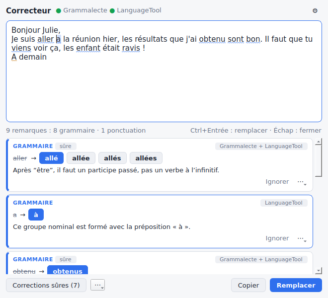
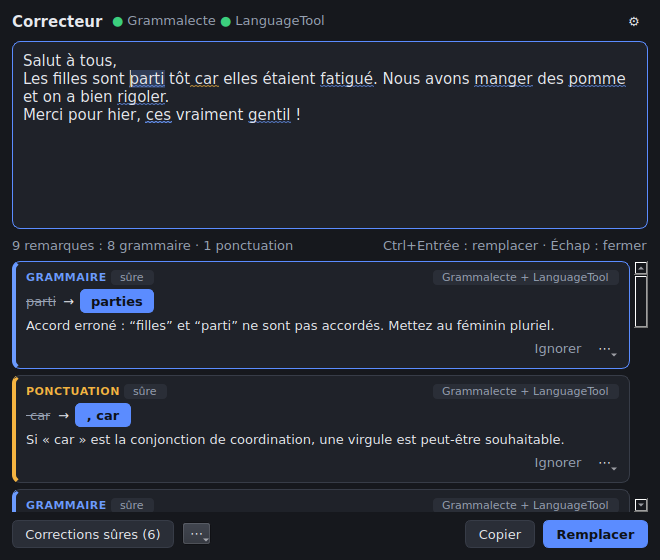
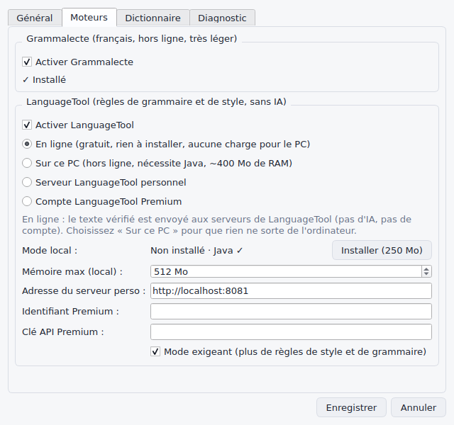
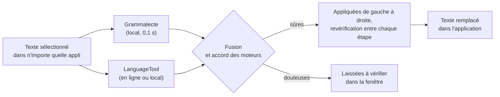

<div align="center">


# Correcteur

**Le correcteur d'orthographe et de grammaire qui marche partout sur votre PC.**<br>
Sélectionnez un texte dans n'importe quelle application, <kbd>Ctrl</kbd> + <kbd>Alt</kbd> + <kbd>X</kbd>, c'est corrigé.

[](https://github.com/mateo-brl/correcteur_orthographe/actions/workflows/tests.yml)


[Installer](#-installation) · [Utiliser](#-utilisation) · [Confidentialité](#-moteurs-et-confidentialité) · [Comment ça marche](#-comment-ça-marche) · [Tests](#-tests-et-qualité)

</div>

<br>

## ✨ En une touche

Sélectionnez, appuyez sur <kbd>Ctrl</kbd> + <kbd>Alt</kbd> + <kbd>X</kbd> : le texte est remplacé directement dans votre
application (navigateur, Word, Discord, Outlook, Thunderbird…). Résultats réels du correcteur :

```diff
- Je suis aller a la réunion hier, les résultats que j'ai obtenu sont bon.
+ Je suis allé à la réunion hier, les résultats que j'ai obtenus sont bons.

- Il faut que tu viens voir ça, les enfant était ravis !
+ Il faut que tu viennes voir ça, les enfants étaient ravis !

- Les filles sont parti tôt car elles étaient fatigué. Nous avons manger des pomme et on a bien rigoler.
+ Les filles sont parties tôt, car elles étaient fatiguées. Nous avons mangé des pommes et on a bien rigolé.
```

Besoin de voir le détail ? <kbd>Ctrl</kbd> + <kbd>Alt</kbd> + <kbd>C</kbd> ouvre la fenêtre de correction :

<table>
  <tr>
    <td></td>
    <td></td>
  </tr>
  <tr>
    <td align="center"><sub>Thème clair</sub></td>
    <td align="center"><sub>Thème sombre (suit le système)</sub></td>
  </tr>
</table>

## 💡 Pourquoi Correcteur

| | |
|---|---|
| 🧠 **Deux moteurs qui se vérifient** | [Grammalecte](https://grammalecte.net), le correcteur français de référence, et [LanguageTool](https://languagetool.org) tournent en parallèle. Chacun attrape des fautes que l'autre rate ; quand les deux sont d'accord, la correction est **sûre**. |
| ⚡ **Correction express prudente** | Seules les corrections sûres sont appliquées, de gauche à droite, avec revérification entre chaque étape. Le reste est laissé « à vérifier » plutôt que deviné : jamais de « fesait » → « fessait » au hasard. |
| 🪶 **Léger** | ~130 Mo de RAM, **0 % de processeur au repos**, un paragraphe analysé en 0,1 s. Pensé pour les petits PC. |
| 🔒 **Sans IA, sans compte, sans pub** | Uniquement des moteurs à règles. Peut fonctionner **100 % hors ligne**. |
| 🖥️ **Partout** | Toutes les applications, sous Windows, Linux X11 et Wayland. Le presse-papiers est restauré après usage. |
| ✍️ **Adapté à l'écrit de tous les jours** | Typographie « standard » : pas de remarques sur les apostrophes courbes ou les espaces insécables dans un simple message. Abréviations courantes acceptées (stp, svp, rdv…). Mode « strict » disponible. |

## 📦 Installation

### Windows

1. Téléchargez **`Correcteur-x.y.z-installation-windows.exe`** dans les
   [versions publiées](https://github.com/mateo-brl/correcteur_orthographe/releases).
2. Lancez-le : aucun droit administrateur n'est nécessaire.

> [!NOTE]
> Le programme n'étant pas signé, Windows peut afficher « Windows a protégé votre ordinateur ».
> Cliquez sur *Informations complémentaires* puis *Exécuter quand même*.

Une version portable (`…-windows-portable.zip`) est aussi disponible : décompressez, lancez `Correcteur.exe`.

### Linux

```bash
tar xzf Correcteur-x.y.z-linux-x86_64.tar.gz
./Correcteur/installer-linux.sh
```

Tout s'installe dans `~/.local`, sans `sudo`. Le correcteur est ajouté au menu des applications et au démarrage de
session, puis lancé.

| Session | Paquets utiles (Debian / Ubuntu) |
|---|---|
| X11 | `libxcb-cursor0` (souvent déjà présent) |
| Wayland | `wl-clipboard`, plus `wtype` (Sway, KDE) ou `ydotool` (GNOME) pour le remplacement automatique |

<details>
<summary><b>Wayland : les raccourcis</b></summary>

<br>

Sous Wayland, une application n'a pas le droit d'écouter le clavier globalement. Les raccourcis se déclarent donc
dans les paramètres du bureau, avec ces commandes :

| Raccourci | Commande |
|---|---|
| <kbd>Ctrl</kbd> + <kbd>Alt</kbd> + <kbd>C</kbd> | `correcteur selection` |
| <kbd>Ctrl</kbd> + <kbd>Alt</kbd> + <kbd>X</kbd> | `correcteur express` |

Sous **GNOME**, c'est automatique : le script d'installation les crée (ou `correcteur raccourcis-gnome`). La commande
transmet l'ordre à l'application déjà lancée : c'est instantané.

</details>

<details>
<summary><b>Depuis les sources</b></summary>

<br>

Python 3.10 ou plus récent est requis.

```bash
git clone https://github.com/mateo-brl/correcteur_orthographe
cd correcteur_orthographe
./scripts/installer-linux.sh                                              # Linux
powershell -ExecutionPolicy Bypass -File scripts\installer-windows.ps1   # Windows
```

</details>

## 🎹 Utilisation

| Raccourci (modifiable) | Action |
|---|---|
| <kbd>Ctrl</kbd> + <kbd>Alt</kbd> + <kbd>C</kbd> | Ouvre la fenêtre de correction sur le texte sélectionné |
| <kbd>Ctrl</kbd> + <kbd>Alt</kbd> + <kbd>X</kbd> | **Correction express** : corrige directement le texte sélectionné |

Dans la fenêtre :

| | |
|---|---|
| Clic sur un mot souligné | Suggestions, *Ignorer*, *Ajouter au dictionnaire* |
| **Corrections sûres** | Applique d'un coup tout ce qui est confirmé (un seul <kbd>Ctrl</kbd> + <kbd>Z</kbd> pour annuler) |
| <kbd>Ctrl</kbd> + <kbd>Entrée</kbd> | Remplace le texte dans l'application d'origine |
| <kbd>F8</kbd> / <kbd>Maj</kbd> + <kbd>F8</kbd> | Faute suivante / précédente |
| <kbd>Échap</kbd> | Ferme (le presse-papiers d'origine est rendu) |

Couleurs : 🔴 orthographe · 🔵 grammaire · 🟠 ponctuation · 🟣 style. Le texte reste modifiable : la vérification
suit la frappe.

L'icône dans la zone de notification donne accès à « Vérifier le presse-papiers », à une fenêtre vide pour taper
ou coller un texte, et aux paramètres.

<details>
<summary><b>En ligne de commande</b></summary>

<br>

```bash
correcteur verifier "Il faut que tu viens demain."     # liste les fautes
correcteur verifier --json --fichier lettre.txt         # sortie JSON, pour des scripts
echo "Je vais a la plage ." | correcteur corriger       # applique les corrections sûres
correcteur corriger --tout < brouillon.txt              # applique toutes les premières suggestions
correcteur diagnostic                                    # état de l'installation
```

`--hors-ligne` n'utilise que les moteurs locaux. Sous Windows, utilisez `correcteur-cli.exe` dans un terminal.

</details>

## 🔒 Moteurs et confidentialité

| Moteur | Où tourne-t-il ? | Coût pour le PC |
|---|---|---|
| **Grammalecte** | sur le PC, toujours | ~65 Mo de RAM |
| **LanguageTool en ligne** *(par défaut)* | serveurs de LanguageTool | aucun |
| **LanguageTool sur ce PC** *(option)* | sur le PC, hors ligne | Java 17+, ~400 Mo de RAM |

> [!IMPORTANT]
> En mode « en ligne », le texte vérifié est envoyé à l'API gratuite de LanguageTool (limitée à environ
> 20 vérifications par minute). Pour que **rien ne sorte de l'ordinateur**, choisissez « Sur ce PC » dans
> *Paramètres › Moteurs*, ou désactivez LanguageTool. Un compte LanguageTool Premium ou votre propre serveur sont
> aussi utilisables.

Le serveur LanguageTool local est lancé en priorité basse, avec une mémoire plafonnée (réglable), et il s'arrête
avec le correcteur, même en cas de fermeture brutale.

<p align="center"></p>

## ⚙️ Paramètres

Clic droit sur l'icône › *Paramètres* : langue (français, détection automatique, anglais, espagnol, allemand…),
typographie standard ou stricte, abréviations, raccourcis, lancement au démarrage, thème, dictionnaire personnel
et règles désactivées.

Les fichiers sont dans `%LOCALAPPDATA%\Correcteur` (Windows) ou `~/.config/Correcteur` (Linux) :
`parametres.json` et `dictionnaire.txt` (un mot par ligne, modifiable à la main).

## 🔍 Comment ça marche



1. **Le raccourci** est intercepté : `RegisterHotKey` sous Windows, `pynput` sous X11, raccourci du bureau sous
   Wayland.
2. **Le texte sélectionné** est lu : sélection primaire X11 ou `wl-paste`, sinon <kbd>Ctrl</kbd> + <kbd>C</kbd>
   simulé. Le presse-papiers d'origine est restauré ensuite (images et fichiers compris sous Windows).
3. **Les deux moteurs** tournent en parallèle : les résultats de Grammalecte s'affichent tout de suite, ceux de
   LanguageTool s'ajoutent dès qu'ils arrivent.
4. **Fusion** : une faute signalée deux fois devient une seule remarque, avec l'accord des moteurs mémorisé.
5. **Une correction est sûre** si les deux moteurs proposent la même, si c'est un accent (« ecole » → « école ») ou
   une ponctuation évidente.
6. **Correction en cascade** : dans « les enfant était ravis », les deux moteurs voudraient « ravi » (accord avec
   « était »), ce qui serait faux. Le correcteur corrige d'abord « enfants », revérifie localement (instantané),
   puis corrige « étaient », et « ravis » redevient juste. Dans une même phrase, il ne mélange jamais une correction
   vers le pluriel et une vers le singulier.
7. **Remplacement** : <kbd>Ctrl</kbd> + <kbd>V</kbd> simulé dans la fenêtre d'origine.

<details>
<summary><b>Optimisations</b></summary>

<br>

- Grammalecte est préchargé au démarrage et garde un cache par paragraphe : seul le paragraphe modifié est
  réanalysé.
- LanguageTool garde un cache et une connexion ouverte ; les longs textes sont découpés automatiquement.
- Pendant la frappe, seul Grammalecte est relancé (instantané), LanguageTool après une courte pause.
- La liste des remarques n'est reconstruite que si elle change réellement.
- Sous X11, les sélections sont lues et servies directement (python-xlib), comme le fait `xclip` : fiable même
  quand l'application tourne depuis des heures en arrière-plan.

</details>

## 📊 Performances

Mesures réelles (Linux, application empaquetée) :

| Mesure | Valeur |
|---|---|
| Mémoire, application résidente avec Grammalecte préchargé | **~130 Mo** |
| Processeur au repos | **0 %** |
| Analyse Grammalecte d'un paragraphe | ~0,1 s |
| Correction express complète, LanguageTool en ligne compris | 1,5 à 3,5 s |
| Correction express hors ligne (Grammalecte seul) | ~0,1 s |
| Espace disque | ~160 Mo (dont la bibliothèque graphique Qt) |

## 🧪 Tests et qualité

**Plus de 110 tests**, lancés automatiquement sur **Windows** et **Linux** (Python 3.10 et 3.13) à chaque
modification :

- moteurs, fusion, corrections sûres, correction en cascade, dictionnaire, paramètres ;
- interface (fenêtre, soulignements, annulation, paramètres) ;
- **tests « vrai bureau »** sous Linux (écran X11 virtuel) : une vraie application ouverte dans un autre processus,
  texte sélectionné, capture, correction express, remplacement, restauration du presse-papiers, raccourci global ;
- tests Windows : raccourcis `RegisterHotKey`, presse-papiers Unicode, sauvegarde et restauration, registre.

```bash
pip install -e ".[dev]"
python -m correcteur installer grammalecte --dossier vendor
python -m pytest                                                              # tests hors écran
xvfb-run -a env QT_QPA_PLATFORM=xcb XDG_SESSION_TYPE=x11 python -m pytest    # + tests « vrai bureau »
```

Tests optionnels : `CORRECTEUR_TESTS_RESEAU=1` (vraie API LanguageTool),
`CORRECTEUR_TEST_LT_DIR=…/LanguageTool-6.6` (serveur LanguageTool local).

**Publier une version** : `git tag v0.1.0 && git push --tags`. La CI construit l'installateur Windows, la version
portable et l'archive Linux, les teste, puis les publie.

<details>
<summary><b>Structure du code</b></summary>

<br>

```
src/correcteur/
├── checker.py        orchestration, fusion des moteurs, corrections sûres et en cascade
├── engines/          Grammalecte, LanguageTool (API + serveur local)
├── platform/         raccourcis, sélection et presse-papiers (Windows, X11, Wayland),
│                     instance unique, démarrage automatique
├── ui/               application Qt : icône, fenêtre de correction, paramètres
└── cli.py            ligne de commande
packaging/            PyInstaller, installateur Inno Setup, icônes
scripts/              installation Linux et Windows
tests/                tests unitaires, interface et intégration bureau
```

</details>

## 📄 Licence

Grammalecte est distribué sous licence GPL v3 et LanguageTool sous LGPL. Les versions empaquetées incluent
Grammalecte : le code de ce dépôt doit donc être diffusé sous une licence compatible avec la GPL v3.

<div align="center">
<br>
<sub>Fait pour écrire sans fautes, sans alourdir le PC.</sub>
</div>
